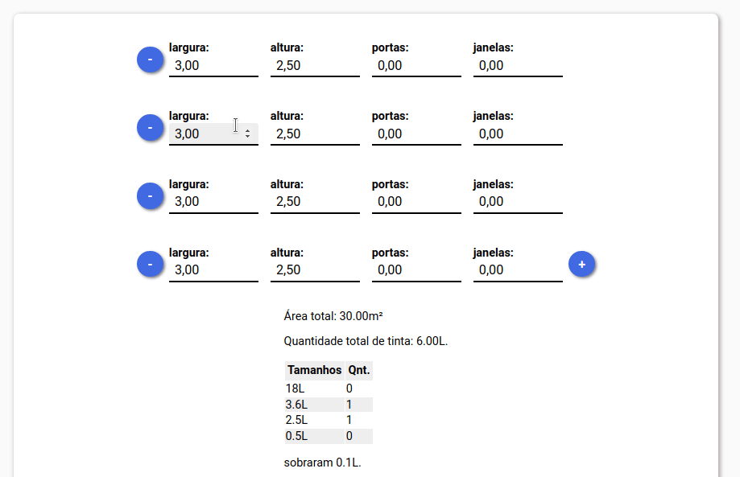

# Calculadora de Tinta

- Você pode adicionar ou remover paredes;
- Adicione portas e janelas para cada parede;
- O programa calcula quanta tinta é necessária, e sugere tamanhos de latas de tinta.



### Instalação

Em um terminal, execute os seguintes comandos: 
```
git clone https://github.com/cooksoundscapes/paint-calculator
```
```
cd paint-calculator
```
```
yarn install
```
```
yarn start
```

Abra uma aba de seu browser e vá ao endereço [localhost:8080](http://localhost:8080).

### Componentes

Este App foi desenvolvido em React.js e é composto basicamente por 2 componentes:  
 1) AreaForm aceita um objeto modelo com, no mínimo:
    * uma propriedade "areaTotal" contendo a função de cálculo de área;
    * um objeto "rules" contendo funções de validação que devem retornar null no caso de sucesso, ou um array contendo a mensagem de erro e os campos alvo;
    * demais propriedades com valores numéricos, que serão interpretadas como campos.
 2) PaintCalculator recebe um valor total de área, um array contendo possíveis litragens para as latas de tinta, calcula a quantidade de tinta e a melhor forma de distribuir este valor entre os tamanhos de lata informados, considerando uma sobra de tinta.  

Este repositório contém um exemplo de uso do componente AreaForm com um objeto-modelo "Parede", que possui áreas sólidas e vazadas. Um outro exemplo de objeto-modelo seria:
```
import { render } from 'react-dom';

const cubo = {
  altura: 0,
  largura: 0,
  profundidade: 0,
  areaTotal = ({altura, largura, profundidade}) => { 
    return altura * largura * profundidade
  },
  rules: {
    altMax: 15,
    alturaMaxima = ({altura, rules.altMax}) => {
      if (altura > rules.altMax) return [["altura"], "Altura máxima excedida."];
      else return null;
    }
  }
}

render(<AreaForm areaConfig={cubo} />, document.getElementById('root'));
```


